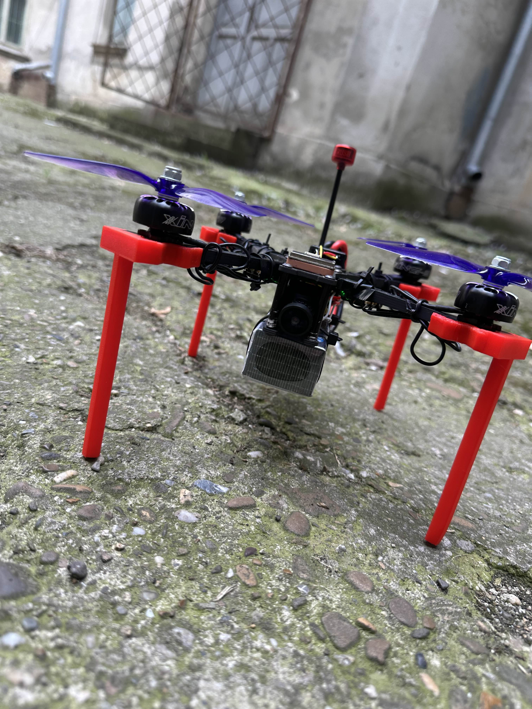
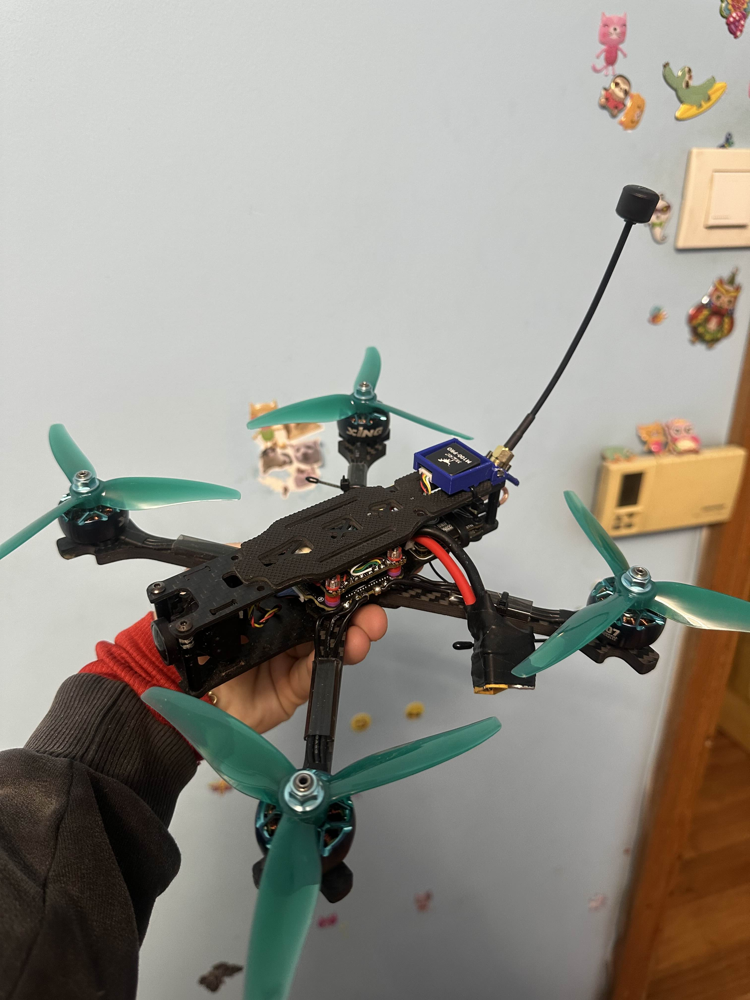

# 🚁 FPV Drone + Object Recognition (Raspberry Pi 5 + OAK-D Lite)

A 5-inch FPV drone built from individual components (all soldering + electronic connections done by me), configured and tuned in **Betaflight**.  
To overcome analog VTX quality limits for my objectives, I integrated a **Raspberry Pi 5** and an **OAK-D Lite** camera to stream a **digital video feed** to a laptop.  
I also designed and 3D-printed landing legs for increased ground clearance and a dedicated Raspberry Pi mounting bracket.

On top of the video pipeline, I trained a **YOLO** model on a dedicated dataset to detect **cars** and **people**, and I’m working on **real-time position estimation** for detected objects using drone telemetry (GPS, altitude, camera angle, drone position, gyroscope data).  
Future goal: **automate drone movement** to track detected objects.

---

## 📌 Table of Contents
- [FPV Drone](#-fpv-drone)
  - [Components](#components)
  - [Construction](#construction)
  - [Firmware](#firmware)
- [Object Recognition](#-object-recognition)
  - [Raspberry Pi + Camera](#raspberry-pi--camera)
  - [YOLO Model](#yolo-model)
  - [Distance & Position Estimation](#distance--position-estimation)
- [Roadmap](#-roadmap)
- [Repo Structure](#-repo-structure)

---

# 🚁 FPV Drone

## Components

### Past

<table>
  <tr>
    <td width="45%" valign="top">
      
    </td>
    <td width="55%" valign="top">

- **Frame:** TBS SOURCE ONE V5 – 5 inch  
- **Flight Controller (FC):** MATEK F405-WMN F405  
- **ESC:** 4× LANRC 45A BLHeli_S  
- **Motors:** iFlight XING-E Pro 2207 1800KV (2–6S)  
- **Analog VTX:** AKK FX3-Ultimate-DVR 5.8G 1W  
- **Receiver:** FlySky iA6B  
- **Antenna:** RUSH Cherry MMCX-J Extended Edition 5.8G  
- **Battery:** HRB 14.8V 4000mAh 4S LiPo  
- **GPS + Compass:** Foxeer M10Q-250 + QMC5883  

    </td>
  </tr>
</table>

---

### Present

<table>
  <tr>
    <td width="45%" valign="top">
      
    </td>
    <td width="55%" valign="top">

- **Frame:** TBS SOURCE ONE V5 – 5 inch  
- **Flight Controller (FC):** Skystars F7 Pro4  
- **ESC:** KO60A BL32  
- **Motors:** iFlight XING2 2207 1855KV  
- **Analog VTX:** TBS Unify Pro32 HV 25–1000mW (**current limitation**)  
- **Receiver:** RadioMaster ELRS 2.4GHz RP4TD-M (True Diversity)  
- **Antenna:** TBS Triumph Pro SMA – Long Range  
- **Battery:** CNHL Black Series 1500mAh 6S 130C  
- **GPS + Compass:** HGLRC M100 PRO  
- **Goggles:** SKY04O PRO  
- **Goggles Antennas:**  
  - MenaceRC Pico Patch RHCP  
  - TrueRC Core 125mm RHCP (SMA)

    </td>
  </tr>
</table>

**Future**
- (ex: upgraded digital link / better latency/quality, custom telemetry integration, autonomous modes)

➡️ Details: `docs/fpv-drone/components.md`

## Construction
- Full manual soldering and electronic connections
- Mechanical mounting + vibration considerations
- Custom 3D printed parts:
  - Landing legs for ground clearance
  - Raspberry Pi mounting bracket

➡️ Details: [`construction/`](construction/)

## Firmware
- Configured and programmed in **Betaflight**
- (ex: receiver setup, modes, rates, PID tuning notes, filters, OSD)

➡️ Details: [`firmware/`](firmware/)

---

# 🧠 Object Recognition

## Raspberry Pi + Camera
- Raspberry Pi 5 on-board compute
- OAK-D Lite camera
- Digital video transmission to laptop (describe protocol/latency/bandwidth here)
- (optional) telemetry sync plan with video frames

➡️ Details: [`rpi/`](rpi/)

## YOLO Model
- Trained on dedicated dataset for:
  - 🚗 Cars
  - 🧍 People
- Training pipeline + evaluation
- Inference pipeline intended for real-time use

➡️ Details: [`yolo/`](yolo/)

## Distance & Position Estimation(working now)
Goal: estimate detected object positions in real time using:
- GPS coordinates
- Altitude
- Camera angle
- Drone position
- Gyroscope data

Planned outputs:
- Object geolocation estimate (lat/lon)
- Relative distance + bearing from drone
- Tracking-ready state for autonomous movement

➡️ Details: `docs/object-recognition/distance-estimation.md`

---

## 🛠 Roadmap
- [ ] Improve digital video feed stability/quality (latency + compression)
- [ ] Telemetry ↔ video frame time synchronization
- [ ] YOLO model iteration + dataset expansion
- [ ] Real-time object position estimation
- [ ] Object tracking (Kalman/ByteTrack etc.)
- [ ] Autonomous movement to follow objects (high-level control loop)

---

## 📁 Repo Structure
- `docs/` – documentation (what/how/why)
- `hardware/` – wiring diagrams, STL/CAD
- `firmware/` – Betaflight dumps, configs
- `vision/` – dataset, training, inference
- `scripts/` – helper scripts (logging, conversion, evaluation)
